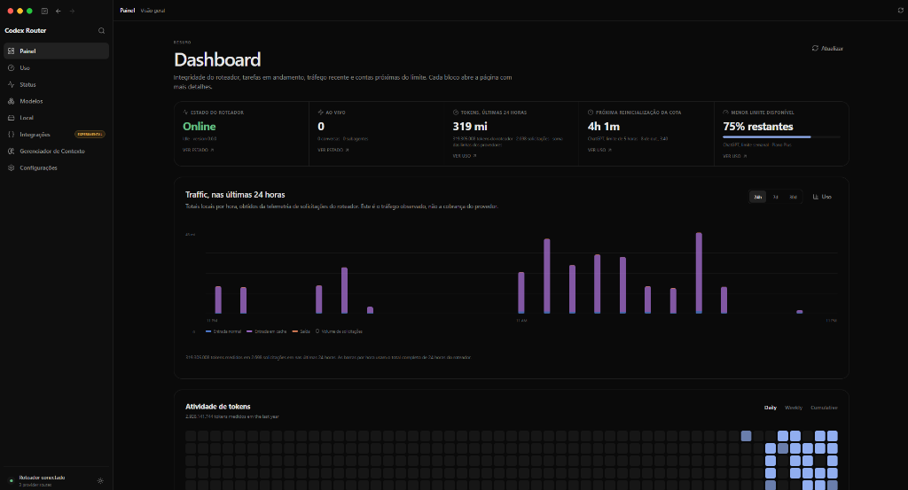

# Codex Router Control Center — PT-BR

-green?style=for-the-badge)

Scripts e catálogo para gerar e instalar uma versão PT-BR do Codex Router Control Center no Windows. O repositório não inclui o aplicativo original; você gera o pacote traduzido a partir do `app.asar` da sua própria instalação.

---

## 🎥 Vídeo Tutorial & Demonstração

<p align="center">
  <a href="https://www.youtube.com/watch?v=mP77ubkrk2k" target="_blank">
    
  </a>
</p>

---

## 📸 Demonstração Visual

<p align="center">
  
  <br>
  <em>Painel de Controle, métricas em tempo real, tráfego e telemetria 100% em Português do Brasil</em>
</p>

---

## O que foi traduzido

A varredura da versão instalada mais recente aplica **868 ajustes PT-BR**: 139 entradas do catálogo, 697 textos diretos, 31 valores dinâmicos e o crédito visual do tradutor. As traduções cobrem telas, estados, configurações, provedores, modelos, uso, erros, datas, horários e descrições. Formatos de números e datas acompanham o idioma selecionado. O seletor inclui Português (Brasil), e uma instalação configurada em português seleciona esse idioma na primeira inicialização. Nomes próprios e termos técnicos permanecem inalterados quando fazem parte da interface.

As traduções ficam em `translations/pt-BR.json` e nos arquivos `translations/inline-pt-BR*.json`. Essa pasta é a fonte necessária para gerar o pacote; não é uma pasta de backup. O instalador cria e mantém os backups originais em `_backup/versions`, dentro da pasta padrão do aplicativo, sem depender de `_Translation Old` nem sobrescrever cópias anteriores. O restaurador valida os hashes registrados e recupera a cópia original correspondente. O manifesto registra a revisão do construtor e os hashes do original e da tradução; assim o instalador detecta pacotes gerados por scripts antigos e os recompila, mesmo que a versão original do aplicativo não tenha mudado.

## Gerar o pacote

Requisitos: Windows, PowerShell e Node.js 18 ou superior. O construtor não usa dependências npm.

1. Copie o arquivo `resources/app.asar` da versão que deseja traduzir para esta pasta, com o nome `app.asar`.
2. Na pasta do projeto, execute:

   ```powershell
   npm run build
   ```

   Ou, sem npm:

   ```powershell
   node tools/build-translated-asar.cjs app.asar app-pt.asar
   ```

3. Os arquivos `app-pt.asar` e `app-pt.asar.manifest.json` serão criados localmente. A geração falha se o cabeçalho, os offsets ou os hashes do pacote de entrada não forem válidos.

## Instalar

1. Execute `Instalar-Traducao.bat`.
2. O instalador compara a versão instalada com o manifesto e gera um pacote compatível automaticamente quando o bundle ainda corresponde às traduções disponíveis.
3. Antes de substituir arquivos, fecha à força os processos do executável da instalação selecionada e valida backups específicos por versão. Uma versão sem suporte é interrompida sem substituir o ASAR instalado.

Ao concluir, `S` abre o aplicativo e fecha a janela do CMD; `N`, `Esc` ou `Enter` fecham sem abrir. A restauração oferece as mesmas opções, inclusive quando o app já está em inglês e nenhum arquivo precisa ser restaurado. Os arquivos PowerShell usam BOM UTF-8 e configuram a entrada e saída do console para exibir acentos e cedilhas corretamente no Windows.

O executável também pode precisar da alteração reversível do Electron Fuse usada por esta distribuição para aceitar um `app.asar` personalizado. O instalador salva cópias do ASAR e do executável identificadas por hash em `_backup/versions`; ele registra os caminhos usados para que o restaurador repare a mesma versão. Backups existentes não são sobrescritos.

O cartão **Aparência**, logo abaixo do seletor de idioma, mostra o crédito **Tradução PT-BR: Emerson Teles** em azul turquesa somente quando **Português (Brasil)** está selecionado.

> [!NOTE]
> **Atualizações do aplicativo:** Sempre que o Codex Router receber uma atualização oficial, os arquivos originais da interface serão restaurados pelo próprio aplicativo. Para continuar usando em português, basta executar o `Instalar-Traducao.bat` novamente após a atualização.

## Restaurar

Execute `Restaurar-Original.bat`. O script fecha os processos da instalação selecionada, valida o backup da versão traduzida e restaura seus arquivos. Se o ASAR já estiver sem as traduções PT-BR reconhecidas, informa que não é necessário restaurar, não altera arquivos e oferece as mesmas opções para abrir ou fechar.

## Arquivos principais

| Arquivo | Função |
| --- | --- |
| `translations/pt-BR.json` e `translations/inline-pt-BR.json` | Traduções da interface |
| `tools/build-translated-asar.cjs` | Aplica as traduções e reconstrói o ASAR com integridade atualizada |
| `aplicar-traducao.ps1` | Instala o pacote com backup e validação |
| `restaurar-original.ps1` | Restaura o backup original |
| `CHANGELOG.md` | Histórico de versões e alterações |

Os arquivos `app.asar`, `app-pt.asar`, o manifesto gerado, backups e temporários são ignorados pelo Git. Eles contêm o aplicativo empacotado e são gerados localmente para a versão instalada.

## Termos

Os scripts deste projeto são distribuídos sob a licença MIT. O Codex Router Control Center e seus componentes pertencem aos respectivos titulares; este projeto não é afiliado nem endossado por eles.

## ✍️ Créditos e Autoria

* **Tradução PTBR - Emerson Teles**
* **Arquitetura e Engenharia:** Emerson Teles
* **Localização:** Português do Brasil (`pt-BR`)
* **Distribuição:** Pacote portátil, autônomo e de alta performance.

*Codex Router Control Center é uma marca registrada de seus respectivos desenvolvedores. Este pacote de tradução é uma personalização desenvolvida de forma independente por Emerson Teles.*

---

## 👨‍💻 Sobre o Autor

Desenvolvido e mantido por **Emerson Teles** (conhecido na comunidade como **Emertels**).

Entusiasta de tecnologia, informática, jogos, manutenção de sistemas e tradução/localização de softwares para Português do Brasil (PT-BR). Desenvolvedor focado em utilitários práticos, ferramentas de produtividade, automação inteligente em PowerShell e soluções completas de localização técnica que aproximam ferramentas modernas do público brasileiro.

### 🛠️ Projetos & Contribuições

- [AI-Chat-Vault](https://github.com/Emertels/AI-Chat-Vault) — Backup portátil e recuperação de conversas locais de 20+ ferramentas e assistentes de IA.
- [Antigravity — Tradução PT-BR](https://github.com/Emertels/Antigravity-Traducao-PTBR) — Localização completa do Google Antigravity Desktop para Português do Brasil.
- [Codex Router — Tradução PT-BR](https://github.com/Emertels/CodexRouter-Traducao-PTBR) — Pacote de tradução e localização do Codex Router Control Center em PT-BR.
- [Cursor AI — Tradução PT-BR](https://github.com/Emertels/Cursor-Traducao-PTBR) — Localização completa e profunda do Cursor AI para Português do Brasil.
- [GPU Tweak III — Tradução PT-BR](https://github.com/Emertels/GPU-Tweak-III-Traducao-PTBR) — Tradução em português brasileiro e instalador automatizado para ASUS GPU Tweak III.
- [Microsoft Photos Fix](https://github.com/Emertels/Microsoft-Photos-Fix) — Solução definitiva em PowerShell e C# para rota de inicialização rápida e visualização no app Fotos do Windows.
- [PSBBN-Translator](https://github.com/Emertels/PSBBN-Translator) — Suíte corporativa de tradução e localização para o PSBBN Definitive Project (PlayStation 2) em 40 idiomas.
- [Silent Hill: Homecoming — Tradução PT-BR](https://github.com/Emertels/Silent-Hill-Homecoming-Traducao-PTBR) — Tradução e revisão completa do jogo para PC em português brasileiro.
- [Suite-Emuladores](https://github.com/Emertels/Suite-Emuladores) — Suíte inteligente em PowerShell para download e atualização autônoma de 56 emuladores e frontends no Windows.
- [ZCode — Tradução PT-BR](https://github.com/Emertels/ZCode-Traducao-PTBR) — Tradução e localização completa do ZCode Desktop para Português do Brasil.

### 🌐 Conecte-se comigo & Comunidades Oficiais

<div align="left">

[](https://github.com/emertels)
[](https://emertels.github.io)
[](https://emertels.github.io/discord)
[](https://x.com/emertels)
[](https://www.youtube.com/@emersonteles2379)
[](https://t.me/apksmodsandroid)
[](https://ko-fi.com/emertels)

</div>
